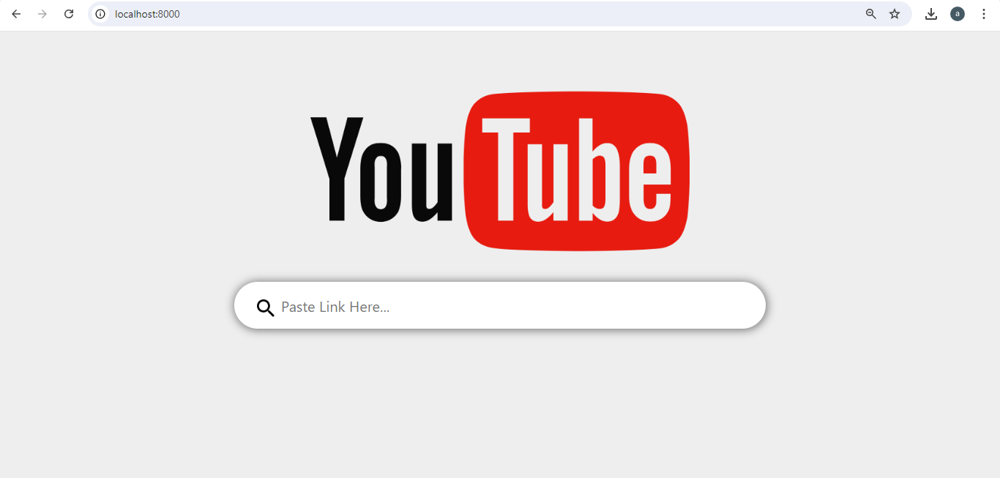

# Django Youtube Video Downloader

This Django project offers a streamlined solution for downloading low-quality YouTube videos. By simply entering a YouTube URL, users can easily select and download videos in a lower resolution. The project utilizes the pytubefix module to ensure smooth video extraction and conversion. This project showcases the integration of Python libraries within a Django framework, providing a focused and user-friendly tool for downloading YouTube videos in a more data-efficient format.


## Installation

Install pytubefix with pip

```bash
  pip install pytubefix
```
For more detail click [here](https://pypi.org/project/pytubefix/)
## 🛠 Skills
HTML, CSS, Python, Django, Bootstrap

## Screenshots


